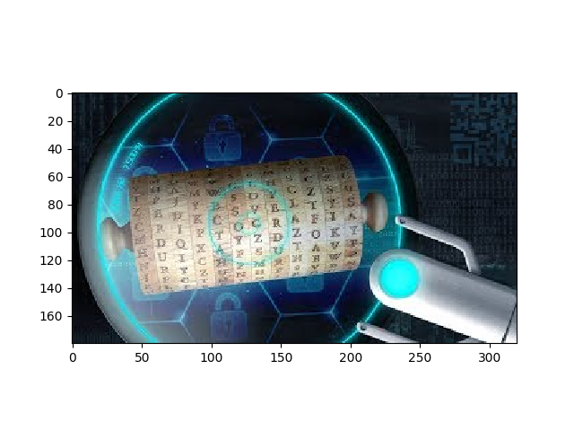
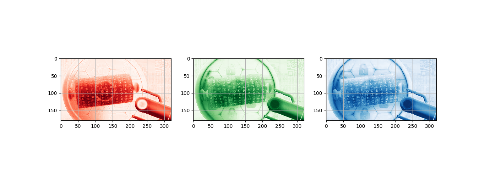
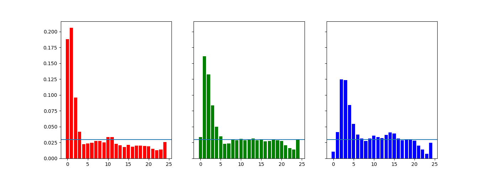
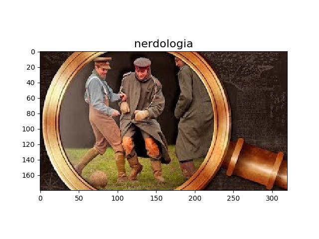

# YouTube thumbnail classification using Pytorch

## Problem
- Given two youtube channels, what [thumbnail](https://www.quora.com/What-is-a-YouTube-thumbnail) corresponds to each channel?
- It is a problem of image classification. 
- We choose two YouTube channels to perform this classification: [Nerdologia](https://www.youtube.com/user/nerdologia) and [Peixe Babel](https://www.youtube.com/user/CanalPeixeBabel).


## Downloading Thumbnails 
We are going to use [CNN (convolutional neural network)](https://en.wikipedia.org/wiki/Convolutional_neural_network) to solve the problem.
The first task that we need to do is to download all thumbnails before starting building the machine learning model.
This task is performed by the class YouTubeCrawler. We use pyyoutube library o access YouTube videos through an API.
Besides, to do the download, you must generate the YouTube API key. See this [link](https://console.developers.google.com/apis/credentials) to get details about the API key.
Then, paste your key in the constructor of YouTubeCrawler class.
````
class YouTubeCrawler:

      def __init__(self):
        self.channels = [YouTubeCrawler.PEIXE_BABEL, YouTubeCrawler.NERDOLOGIA]
        api_key = '' # paste your key here
        self.api = Api(api_key=api_key)

````

After that,  by calling the `fetchThumbnails` method, you will retrieve 400 thumbnails of each channel.

## RGB Colors as Input Features

Each thumbnail image can be described as vectors of [RGB colors](https://en.wikipedia.org/wiki/RGB_color_model).
R stands for red, G stands for green, and B stands for blue.
It means that a thumbnail has three vectors of numbers where each represents how much of the red, green, and blue the image has. 

We extract these vectors in the `fetchThumbnails` method and put them into a Thumbnail class instance. 
After this extraction process, you have the original image and the RGBs vectors.
In figure 1, there is an example of a thumbnail of nerdologia channel. 


|  | 
|:--:| 
| *Figure 1. Example of a thumbnail* |
 


In figure 2, we plot the same image three times, each one considering one vector of colors.

|  | 
|:--:| 
| *Figure 2. Thumbnail RGB* |

In figure 3, we have the RGB distribution represented by histograms.


|  | 
|:--:| 
| *Figure 3. RGB vectors as histograms* |

The code that plots figure 1,2,3 is in the `plot method` in the class `Thumbnail`.
We also save the downloaded thumbnails in the file `thumbnails.npz`.

## Neural Network Architecture

Once having the input features, the next step is to define the CNN architecture.
We put two 2d convolutions followed by relu activation function in the convolution/activation layer.
Then, we place a max-pooling 2d function in the pooling layer and flatten the vectors.
Finally, we put two linear transformations in the fully connected layer that is followed by a softmax function.
The softmax function will say if a thumbnail belongs to nerdologia or peixe babel channel.

[In this video](https://www.youtube.com/watch?v=bNb2fEVKeEo), the researcher Serena Yeung explains in detail how CNN works.

The class `Net` describes our CNN architecture.

## Training and Testing Process

Then, we start the training process by dividing our dataset into training and test set. 
We instantiate the model (class `Net`), feed it with data, and calculate the metrics accuracy, precision, recall, and f-measure (F1) to verify the quality of the classifications.
After each iteration, it is possible to see the model improvement in the log:

`````
Train Epoch: 10 [530/574 (91%)]	Loss: 0.619260
Train Epoch: 10 [540/574 (93%)]	Loss: 0.410600
Train Epoch: 10 [550/574 (95%)]	Loss: 0.341183
Train Epoch: 10 [560/574 (97%)]	Loss: 0.436197
Train Epoch: 10 [228/574 (98%)]	Loss: 1.016665

Test set: Average loss: 0.2127, Accuracy: 94/101 (93.07%), Precision: 0.94, Recall: 0.92, F1: 0.93 
`````

Take a look at the method train and test to see how we build the model.

## Predictions

Having the model, we can start to make predictions. You inform a new thumbnail and the model will classify it into nerdologia or peixe babel (our channels).
That's the idea of the method `predict`. 
Below in figure 4, there is an example of a prediction where the model classified the thumbnail as nerdologia.

|  | 
|:--:| 
| *Figure 4. Prediction* |


## Conclusion

PyTorch is very developer-friendly. It gives you the possibility to define reusable classes/modules in an object-oriented programming manner. 
I find PyTorch approach flexible and powerful.


